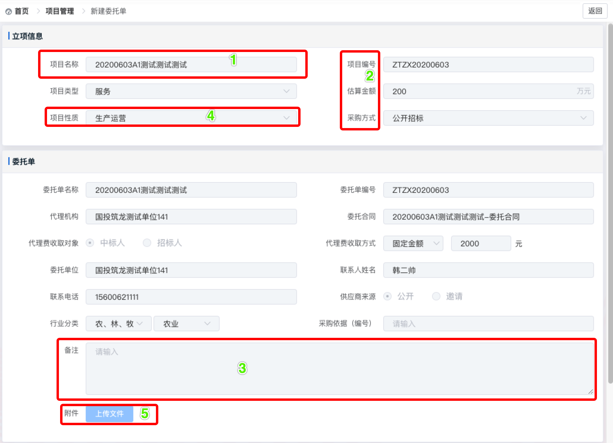
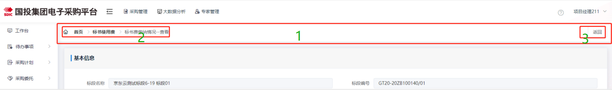
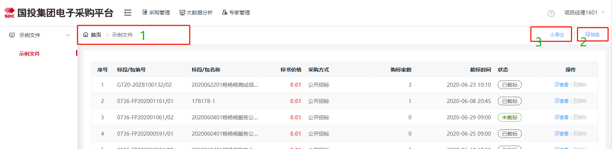
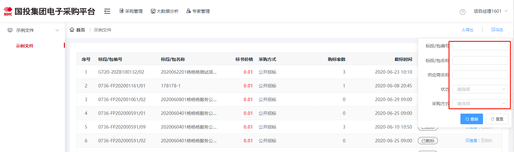

# 开发使用命令

## 依赖包安装
```
npm install
```

### 开发服务启动
```
npm run serve
```

### 线上打包命令
```
npm run build // 打包命令

```

# 项目ui统一风格
## 一.列表详情页 form表单部分
1.form表单输入框，下拉框，日期框，button等表单组件统一使用  size=”small” 形式

2.统一右对齐，有无是否验证，文字都要对齐，文字保持一行

3.多行文本统一使用 row=”4”行数统一输入框，多行文本统一使用 placeholder=”请输入”

4.input包含单位（元）放右侧

5.下拉框，日期选择框统一使用 placeholder=”请选择”

6.form文件上传预览统一使用上传组件

7.表单操作的保存，提交等按钮操作成功需要给出成功提示，统一使用message

#### 示例如下


## 二.列表详情页面title部分

1.统一固定在上方，不跟随滚动条滚动

2.面包屑部分 如：首页>模块名称>标书缴纳情况--查看

3.右侧操作按钮

#### 示例如下


# 三.列表页table表头搜索条件部分

1.统一使用面包屑导航

2.table表格筛选调节默认隐藏，点击展开

3.其他表格操作，如新增、导出，统一放在筛选前方

4.展开后使用small大小，查询，重置附带图标靠右侧显示，重置不关闭弹窗，搜索关闭弹窗

#### 示例如下
未展开状态


展开状态


# 四.列表页表格展示部分

1.表格信息统一单行显示，如时间使用min-width避免换行，标段名称使用 tooltip

2.表头固定，表格内容滚动

3.表格对齐规则

（1）默认左对齐，日期类，操作列
（2）数字类，金额类，右对齐
（3）序号列，多选框居中

4.表格操作列中button按钮统一使用 size=“mini” 使用图标＋文字的形式

```详细图标详情查看地址
详细图标详情查看地址（建议下载到本地使用浏览器查看）
https://github.com/john-ehsure/zl_iconfont
```

```操作图标选择与规范
<template slot-scope="{row}">
  <el-button-group class="operation-button-group">
    <!-- 查看 -->
    <el-button type="primary" plain size="mini" @click="checkout(row)" class="operation-button">
      <i class="iconfont icon-anniutubiao-"></i>查看
    </el-button>
    <!-- 删除 -->
    <el-button type="info" plain size="mini" @click="checkout(row)" class="operation-button">
      <i class="iconfont icon-shanchu1"></i>删除
    </el-button>
  </el-button-group>
</template>

```

5.操作列中删除添加二次确认弹窗（避免误删）使用Popconfirm气泡确认框

6.列表列数过多，操作列固定右侧比如大于10列

7.无数据显示自定义动画

8.加载数据使用默认loading
    
9.table使用border模式

10.状态列分成功，失败，其他显示类型，样式统一使用
```状态样式  消极的 红色    积极的 绿色   进行中 橙色    其他 灰色
<template slot-scope="{row}">
  <span class="status-success" v-if="row.status==4">成功</span>
  <span class="status-fail" v-else-if="row.status==3">失败</span>
  <span class="status-going" v-else-if="row.status==2">进行中</span>
  <span class="status-other" v-else>其他</span>
</template>
```
11.金额列，红色加粗显示，样式统一使用 table-column-money
```金额样式
<el-table-column prop="money" label="金额（元）" align="right" class-name="table-column-money">
</el-table-column>
```


#### 示例如下


#### 当前所有规范可参考 <font color=red>guotou-template</font>项目


# 开发项目规范（良好的规范能够有效的提升开发效率）

### 文件命名规范(禁止使用汉字首字母)，命名要求 见词知意
1.文件夹命名统一使用小写字母，禁止使用其他字符 ，例如：templatelist

2.文件命名统一使用小驼峰形式，禁止使用其他字符，例如：templateList

3.router 路径path命名统一使用文件的名称，一个大模块新建一个js文件，避免js文件过多分类不清晰，例如：展示的vue文件为templateList.vue时，应该设置path:'/layout/templateList'，方便查找对应文件

4.server 请求名称统一使用小驼峰形式，一个大模块新建一个js文件，避免js文件过多分类不清晰，例如：moduleTemplateList，避免冲突建议使用接口的路径拼接 例如：module/templateList.do

5.setting 状态字典设置统一使用小驼峰形式，一个大模块新建一个js文件，避免js文件过多分类不清晰，例如：moduleTemplateType,建议类型以type结尾，状态以status结尾

6.filters 过滤器，使用频率高的方法抽离出来到公共的方法中

7.mixins 可统一抽离的部分逻辑处理，定义的字段抽离出来

### 代码注释规范
###### 1. data字段 状态类，功能类，要求写好对应的注释
```data
data() {
    return {
      payStatus: 1,// 支付状态  1 支付成功  2 支付失败  
      total: 0,// 表格总条数
    }
}

```
###### 2. js部分 方法有对应的注释解释，参数也要有对应的解释
```js
methods: {
    /*
    *  支付点击调用的方法
    *  params  url  支付请求地址   
    *  params  type  支付请求的类型  微信 支付 等
    */
    handlePay(url,type){
        // 具体逻辑处理
    }
}

```
###### 3. template 大的模块分类要有对应的注释
```tempalte
<tempalte>
    <div class="page-item">
        <!-- 标书模块 -->
        <div class="item-tender"></div>
        <!-- 服务费模块 -->
        <div class="item-service"></div>
    </div>
</tempalte>
```
###### 4.css注释部分(需要改变内部组件统一使用穿透模式 ::v-deep)
```scss
<style lang="scss" scope>
.page-item {
  text-align: left;
  /*标书模块*/
  .item-tender{
    color:#333;
  }
  /*服务费模块*/
  .item-tender{
    color:#666;
  }
  ::v-deep.el-date-editor .el-range-separator {
    width: 10%;
  }
}
</style>
```


